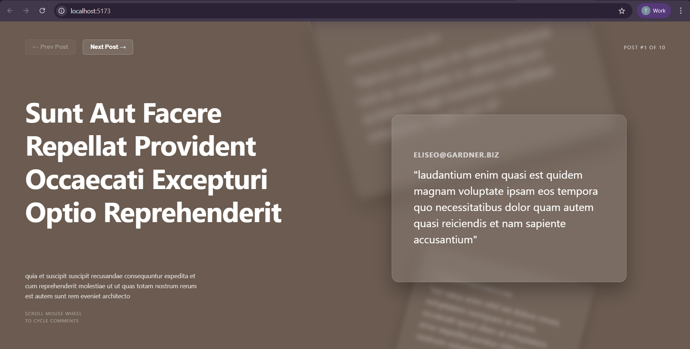

# Post Browser (Vanilla JS + TypeScript)

A lightweight **Post Browser** built using **Vanilla JavaScript/TypeScript**.
The application fetches posts from an API and displays them using a prebuilt UI template.

---

## 📸 Screenshot



---

## 🚀 Features

- **API Integration:** Fetch posts from an external REST API.
- **Clean UI:** Uses a prebuilt template for a modern look.
- **Caching Layer:** Client-side caching to reduce redundant network requests.
- **Type Safety:** Built with **TypeScript** for better developer experience.
- **Zero Frameworks:** High performance with no frontend library overhead.
- **Modern Tooling:** Fast development and bundling using **Vite**.

---

## 📂 Project Structure

```text
.
├── public/
├── src/
│   ├── assets/
│   ├── APIService.ts
│   ├── CacheService.ts
│   ├── main.ts
│   └── style.css
├── index.html
├── package.json
└── tsconfig.json

```

### Key Files

- **`APIService.ts`**: Logic for fetching data using the Fetch API.
- **`CacheService.ts`**: Simple in-memory or LocalStorage caching logic.
- **`main.ts`**: The application entry point that initializes the app and handles DOM manipulation.

---

## 🛠 Installation & Setup

1. **Clone the repository:**

```bash
git clone https://github.com/Tejas1546/cc-7-Tejas
cd "./Assignment 3/Tasks/Task 8"

```

2. **Install dependencies:**

```bash
npm install

```

3. **Start the development server:**

```bash
npm run dev

```

The application will be available at `http://localhost:5173`.

---

## 💻 Tech Stack

- **Language:** [TypeScript](https://www.typescriptlang.org/)
- **Build Tool:** [Vite](https://vitejs.dev/)
- **Markup/Styling:** HTML5 & CSS3
